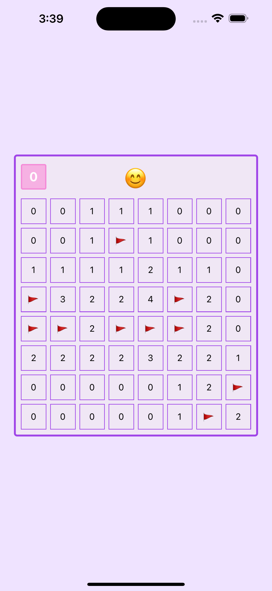

### Description

A fully-playable 8 x 8 minesweeper game in React Native that includes the following:

- Start new game button 😊
- 10 randomly-placed mines
- Press any cell to show how many mines it touches, or if it's an exploding mine!
- Long-press to mark a mine
- Counter shows number of unmarked mines remaining
- Auto-expanding adjacent cells with zero adjacent mines

Does not yet have:

- Calculated "winner" state

### Demo

### Screenshots

| New Game                                | Winner                                 | Loser                                 |
| --------------------------------------- | -------------------------------------- | ------------------------------------- |
|  |  |  |
